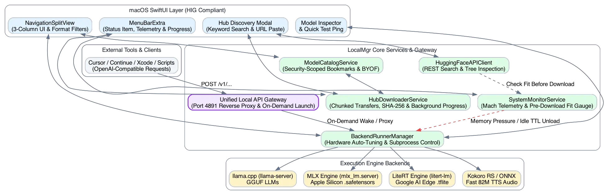

# LocalMgr: macOS Local AI Model & Engine Orchestrator
**Architecture & UX Blueprint (Enhanced with Jan/Cortex Patterns)**

---

## 1. Executive Summary & Vision

**LocalMgr** is a standalone, native macOS application built with SwiftUI and designed according to Apple's Human Interface Guidelines (HIG). It bridges the gap between powerful CLI execution engines (`llama-server`, `mlx_lm.server`, `gemma.cpp`, and specialized audio engines like Kokoro RS) and macOS users who want transparent, granular control over their local model weights and hardware resources.

Unlike opaque managers (e.g., Ollama) that obscure model files inside hidden blobs, **LocalMgr** treats local folders as first-class citizens: allowing users to attach arbitrary directories, inspect raw `.gguf` and `.safetensors` headers, monitor Apple Silicon Unified Memory pressure in real time, and seamlessly swap execution engines with a single click.

By adopting key architectural patterns learned from open-source managers like Jan (`janhq/jan`), **LocalMgr** integrates a built-in **Unified Local API Gateway**, kernel-level **Emergency Pressure Release**, and Apple Silicon **Hardware Auto-Tuning Profiles**.

### System Architecture Diagram



> [!NOTE]
> For a detailed mapping of user goals to architectural components, issue tracker IDs (`bd`), and Diátaxis guides, see **[USER_JOURNEYS.md](USER_JOURNEYS.md)**.

---

## 2. Core Feature Pillars & Enhanced Patterns

### A. Transparent Folder & Vault Management (BYOF)
* **Security-Scoped Bookmarks**: Users attach existing directories (`~/Models/GGUF`, `~/Models/MLX`, `~/.cache/huggingface/hub`) without copying or duplicating multi-gigabyte files.
* **Header & Chat Template Auto-Inspection**: Automatically parses `.gguf` binary metadata (architecture type, quantization level such as `Q4_K_M` / `Q8_0`, context length, and embedded `tokenizer.chat_template` strings) and MLX `config.json` without loading full weights into RAM.
* **Folder Watcher & Checksum Verification**: Uses `DispatchSourceFileSystemObject` / `FSEvents` to detect external modifications and performs streaming SHA-256 hash verification during Hugging Face chunked downloads.

### B. Unified Local API Gateway (Reverse Proxy)
* **Single Stable Endpoint**: Exposes a built-in Swift HTTP gateway on port `4891` (`http://127.0.0.1:4891/v1/chat/completions`, `/v1/models`, `/v1/audio/speech`).
* **Transparent Routing**: Proxies requests from external tools (Cursor, Continue.dev, Xcode, scripts) to whichever engine (`llama-server` or `mlx_lm.server`) is currently active.
* **On-Demand Warm-Up**: If a request arrives specifying an inactive model in `body.model`, LocalMgr can automatically wake up and launch the required engine in the background before streaming responses.

### C. Unified Apple Silicon Memory & Health Telemetry
* **Real-Time RAM Breakdown**: Queries host kernel statistics (`mach_host_basic_info`, `vm_stat`) to track Wired, Active, Inactive, and Compressed RAM, plus Page-Outs/Thrashing indicators.
* **Predictive Fit Gauge**: Calculates a **Memory Fit Score** before launching a model (Comfortable vs. Tight vs. Thrashing).
* **Idle VRAM Reclaiming & Emergency Pressure Release**:
  * **OS Pressure Hook**: Listens to macOS memory pressure events (`DISPATCH_SOURCE_TYPE_MEMORYPRESSURE`). If the OS reports critical swap thrashing, LocalMgr instantly pauses or terminates background runners to restore system responsiveness.
  * **App Exit Protection**: Hooks into `applicationWillTerminate(_:)` in `@MainActor class AppDelegate` to cleanly terminate background subprocesses (`llama-server`, `mlx_lm.server`) when LocalMgr quits, preventing orphaned servers.

### D. Multi-Backend Engine Orchestration & Hardware Auto-Tuning
* **Apple Silicon Auto-Tuning**: Queries `sysctlbyname("hw.model")` and physical memory sizes to auto-configure optimal flags per chip tier (e.g., `-ngl 99`, `--flash-attn on`, thread counts, and context caps for M1/M2/M3/M4 Pro/Max/Ultra).
* **Unified Lifecycle & Log Control**: Manages engine binary execution via `Process` (`NSTask`), dynamic port allocation, and pipe forwarding for live terminal stdout/stderr logs with copyable text selection, strict per-model view isolation, auto-clearing upon new run launches, and manual trash clearing.
* **Guaranteed In-App Verification**: Provides an interactive Quick Test Ping tab sending 256-token prompts to active runners, extracting both `content` and `reasoning_content` for thinking models (e.g., Gemma 4, DeepSeek-R1), backed by main-actor state persistence and manual output resetting.

### E. Hugging Face Hub Discovery & Global Background Downloader (CUJ-4)
* **Dual Discovery Modes**: Supports live keyword searches against `https://huggingface.co/api/models` alongside direct URL/Repo ID paste fields.
* **Pre-Download Memory Fit Verification**: Calculates exact RAM requirements for repository weight files before download begins, displaying live fit indicators (`🟢 Fits comfortably` vs `🔴 Exceeds RAM`).
* **Global Background Transfer Engine**: Downloads persist independently when discovery panels are dismissed, showing real-time progress bars, speeds (MB/s), and ETA inside the main window toolbar and `MenuBarView`, complete with streaming SHA-256 integrity validation.
* **Storage Location Hierarchy**: Downloads default to `~/Library/Application Support/LocalMgr/Models/`, with custom overrides available in Settings and per-download vault destination pickers.

### F. Enterprise Ops & Hybrid Cloud Federation ([RFC 001](RFC_001_ENVOY_AI_GATEWAY_HYBRID_FEDERATION.md))
* **Phase 1 Priority (Native Swift Telemetry Parity - Completed in v0.4.0)**: Implements exact Envoy AI Gateway observability conventions (Prometheus counters `ai_gateway_llm_token_usage_total`, latency histograms `ai_gateway_llm_request_duration_seconds`, OTel spans) inside native `/metrics` and `/v1/stats` endpoints on `LocalAPIGateway` with zero container overhead.
* **Phase 2 (Ops Sidecar Mode & Scaling Spectrum)**: Bridges standalone developer laptops with shared Mac Studio inference racks and remote GKE/K8s clusters, providing an optional containerized Envoy AI Gateway sidecar deployment profile (`envoyproxy/ai-gateway`) for hybrid cloud route failover and quota enforcement.

### G. Enterprise Ops Telemetry Store & Monitoring Dashboard (CUJ-R2 / CUJ-6)
* **Append-Only Persistent Storage**: Records every proxy completion event continuously to `~/Library/Application Support/LocalMgr/Telemetry/history.jsonl` using append-only `FileHandle` operations to ensure zero UI frame drops during high-speed token generation.
* **Standardized Observability Metrics**: Exposes `GET /metrics` (Prometheus text exposition format) and `GET /v1/stats` (structured JSON) aligned with Envoy AI Gateway stat conventions (`ai_gateway_llm_requests_total`, `ai_gateway_llm_token_usage_total`, `ai_gateway_llm_upstream_health_status`).
* **KV Cache & Thermal Accounting**: Parses `prompt_tokens_details.cached_tokens` to calculate prefix cache hit rates (`cached / prompt`) and correlates inference runs with live kernel thermal states (`ProcessInfo.processInfo.thermalState`).
* **Interactive Ops Dashboard**: Dedicated UI panel (`Cmd+Shift+O`) displaying lifetime request/token cards, thermal health, per-model comparative rankings, and an automated **One-Click Benchmark Matrix** harness.

---

## 3. Supported Model Backends

| Engine / Backend | Target Formats | Primary Use Cases | Key Capabilities & Flags Managed |
| :--- | :--- | :--- | :--- |
| **`llama.cpp` (`llama-server`)** | `.gguf` | General LLMs (Llama 3, Gemma 2, Mistral, Cohere North Mini) | Metal GPU layer offload (`-ngl`), Flash Attention, context size (`-c`), batching |
| **MLX (`mlx_lm` / Swift MLX)** | `.safetensors` (MLX format) | Apple Silicon native fine-tunes & optimized LLMs | Zero-copy Unified Memory sharing, Apple Silicon optimized execution |
| **Kokoro RS / ONNX** | `.onnx` / Rust binary | High-fidelity, ultra-fast 82M Text-to-Speech (TTS) | Sample rate selection, voice pack management (`.bin` / `.pt`), instant streaming audio playback |
| **`gemma.cpp`** | `.sbs` / `.gguf` | Minimalist Google Gemma deployment | High-speed C++ CPU/SIMD execution (Supports Gemma 1 & 2; see Roadmap below) |

### Future Roadmap: Gemma 4+ & `gemma.cpp` Tracking
* **Current Status**: As of 2025/2026, `google/gemma.cpp` natively supports **Gemma 1**, **Gemma 2**, **RecurrentGemma**, and **PaliGemma**, but has not yet updated its SIMD kernels and weight loaders to officially support latest **Gemma 4+** model architectures.
* **Primary Strategy for Gemma 4+**: For immediate execution of latest Gemma 4+ weights on Apple Silicon, LocalMgr prioritizes **`llama-server`** (Metal GPU offloading via `-ngl 99`) and **`mlx_lm.server`** (native Apple Silicon `.safetensors`), both of which actively release zero-day updates for new Gemma architectures.
* **Roadmap Watch Item**: We are actively tracking the `google/gemma.cpp` repository. Once the `gemma.cpp` team ships upstream support for Gemma 4+, we will re-evaluate incorporating it as a specialized lightweight CPU/SIMD reference runner alongside our primary GPU engines.

---

## 4. macOS HIG & UI/UX Architecture

Adhering to the Apple Human Interface Guidelines (`macos-hig-layout` & `macos-hig-interaction`), LocalMgr prioritizes high-density ergonomics, keyboard centricity, and non-blocking background orchestration.

```
+-------------------+-----------------------------------+-----------------------------------+
| SIDEBAR           | MODEL CATALOG / LIST              | INSPECTOR & PLAYGROUND            |
|                   |                                   |                                   |
| [Locations]       | Filter: [All] [GGUF] [MLX] [Audio]| Model: Cohere North Mini Code     |
| * Local Vault     |                                   | Format: GGUF • Q4_K_M • 7.2 GB    |
| * Hugging Face    | [🟢 Running] Cohere North Mini    |                                   |
|                   | 7.2 GB • 8192 ctx • Gateway Ready | [Memory Fit: 🟢 7.2 GB / 24 GB]   |
| [Engines]         |                                   |                                   |
| * llama-server    | [⚪️ Stopped] Gemma 2 9B IT        | Auto-Tuning Profile: M3 Max (64GB)|
| * MLX Server      | 5.4 GB • Q4_K_M                   | Chat Template: [ Cohere Command v]|
| * Kokoro TTS      |                                   | GPU Layers:   [========|] 99      |
|                   | [⚪️ Stopped] Kokoro RS 82M        |                                   |
| [Gateway & Health]| 320 MB • ONNX • Voice: American   | Action: [ Swap & Run Model ]      |
| * Port 4891 Active|                                   |                                   |
| * Idle TTL: 15m   |                                   | Tabs: [Logs] [Chat/TTS Preview]   |
+-------------------+-----------------------------------+-----------------------------------+
```
