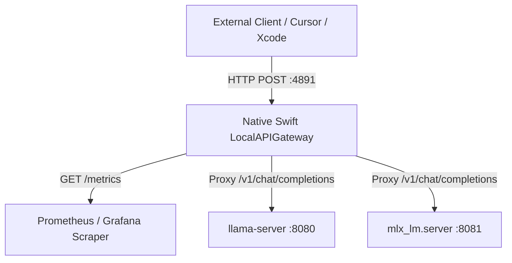
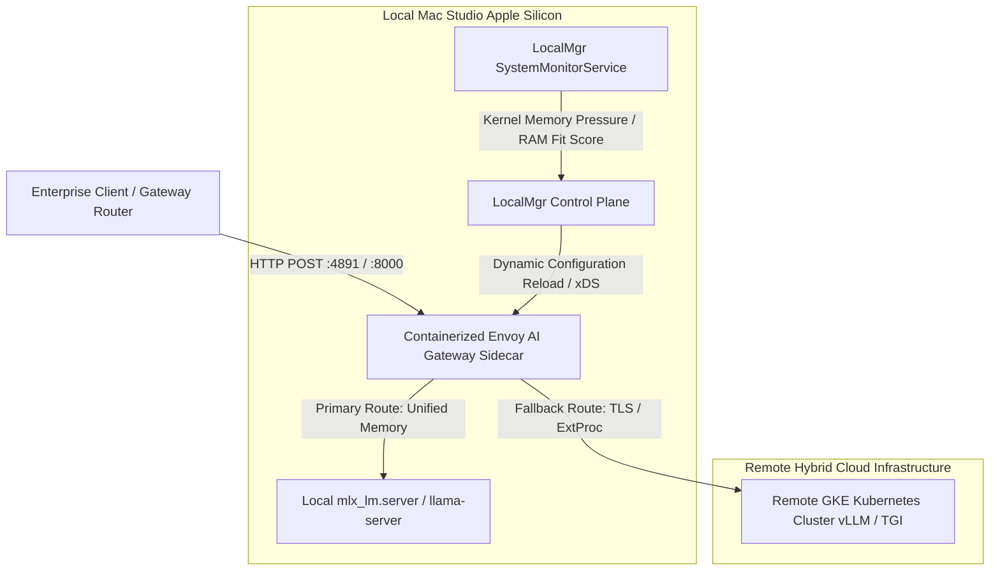

# RFC 001: Envoy AI Gateway (`envoyproxy/ai-gateway`) Hybrid Cloud Federation & Observability Migration

- **Status:** Proposed / Research Draft
- **Authors:** LocalMgr Architecture & Research Team
- **Date:** July 2026
- **Target Application:** LocalMgr (macOS Apple Silicon, Swift 6 / SwiftUI)

---

## 1. Executive Summary & Problem Statement

### 1.1 Current Architecture (`LocalAPIGateway`)
**LocalMgr** currently features a native Swift 6 in-process HTTP reverse proxy (`LocalAPIGateway`) bound to loopback TCP port `4891` (`http://127.0.0.1:4891`). Built on Apple's `Network.framework` (`NWListener` and `NWConnection`), it provides:
- **Transparent OpenAI-compatible routing** (`/v1/chat/completions`, `/v1/models`) to local backend execution engines (`llama-server`, `mlx_lm.server`).
- **On-demand model warm-up**: Waking up and spinning up inactive models when requested via `body.model`.
- **Zero-dependency footprint**: Pure native macOS binary execution requiring no container daemons or background virtual machines.

### 1.2 The Hybrid Cloud & Enterprise Ops Challenge
While the built-in Swift gateway is ideal for standalone developers running local inference on Apple Silicon laptops, enterprise **Ops personas** managing racks of Mac Studios or hybrid cloud infrastructure face complex orchestration needs that exceed simple reverse proxying:
1. **Advanced Routing & Failover**: Dynamically federating traffic between local Apple Silicon unified memory engines (`mlx_lm.server` / `llama-server`) and remote Kubernetes/GKE inference clusters (running vLLM, TensorRT-LLM, or TGI) when local memory pressure exceeds safe limits or requests require multi-GPU concurrency.
2. **Enterprise Telemetry Standardization**: Exporting structured OpenTelemetry (OTel) traces and standardized Prometheus metrics (token volume, Time-to-First-Token [TTFT], Inter-Token Latency [ITL], rate limit rejections) into enterprise Grafana and Prometheus monitoring stacks.
3. **Rate Limiting & Quota Management**: Enforcing token-based or concurrency-based quotas across multi-tenant development teams sharing high-end Mac Studio (M3/M4 Ultra 128GB/192GB) hardware.

To bridge this gap without sacrificing our native Swift simplicity for individual users, this RFC defines a **progressive migration and federation architecture** leveraging **Envoy AI Gateway (`envoyproxy/ai-gateway`)**.

---

## 2. Apple Container & ARM64 Status (`envoyproxy/ai-gateway`)

### 2.1 Upstream Containerization & Apple Silicon Compatibility
Envoy Proxy (`envoyproxy/envoy`) maintains robust upstream multi-architecture builds, publishing official container images for both `linux/amd64` and `linux/arm64` (`aarch64`). However, specialized AI extension layers—specifically **Envoy AI Gateway (`envoyproxy/ai-gateway`)**, which implements external processing (`ext_proc`) filters and specialized LLM routing/header transformations—present specific containerization considerations on Apple Silicon macOS:

1. **Container Runtime Environments on macOS**:
   - **Docker Desktop for Mac & OrbStack**: Run lightweight Linux virtual machines (using Apple's `Virtualization.framework` hypervisor) with native `arm64` kernel support. Containerized Envoy builds run at native ARM64 speed. However, bridge networking and socket forwarding between macOS loopback (`127.0.0.1`) and virtualized container namespaces introduce a slight networking overhead (~0.5ms–1.5ms) compared to native macOS sockets.
   - **Apple Virtualization.framework Native Linux Containers**: Modern macOS (14+) supports lightweight Linux VMs with VirtioFS (zero-copy file sharing) and VirtioNet (high-throughput virtual networking). Running an `arm64` Envoy AI Gateway container inside an OrbStack or native `Virtualization.framework` VM provides near-bare-metal network throughput.

2. **Identified Upstream Gaps & Open-Source Contribution Opportunities**:
   Our investigation into `envoyproxy/ai-gateway` identified key areas where the LocalMgr engineering team can contribute back to the upstream open-source community:
   - **Native ARM64 / Apple Silicon CI Pipelines**: Upstream testing and release automation for AI Gateway extensions often prioritize `x86_64` Linux Kubernetes targets. Contributing automated multi-arch GitHub Actions CI workflows verifying `linux/arm64` image builds and container performance on Apple Silicon runners.
   - **Host Network & Loopback Bridge Tooling for macOS**: Developing and upstreaming configuration templates that allow Envoy container instances running on macOS container runtimes (e.g., OrbStack or Docker Desktop) to seamlessly bind and discover host loopback processes (`llama-server` on dynamic host ports) via `host.docker.internal` or VirtioNet routing without firewall friction.

---

## 3. OpenTelemetry (OTel) & Prometheus Metric Catalog

To ensure complete observability parity between LocalMgr's native Swift gateway and Envoy AI Gateway sidecars, both deployment tiers must adhere to a standardized telemetry schema aligned with **OpenTelemetry GenAI Semantic Conventions** and Envoy's stat tree definitions.

### 3.1 Prometheus Exposition Metrics (`/stats/prometheus` & `/metrics`)
The gateway must emit the following exact Prometheus metric hierarchies:

| Prometheus Metric Name | Type | Labels / Dimensions | Description |
| :--- | :--- | :--- | :--- |
| `ai_gateway_llm_token_usage_total` | Counter | `model`, `backend`, `direction="prompt\|completion\|reasoning"` | Total tokens processed across incoming prompts, completions, and thinking model reasoning tokens (`reasoning_content`). |
| `ai_gateway_llm_request_duration_seconds` | Histogram | `model`, `backend`, `phase="ttft\|itl\|e2e"`, `status_code` | Latency distribution tracking Time-to-First-Token (TTFT), Inter-Token Latency (ITL), and End-to-End execution duration. |
| `ai_gateway_llm_requests_total` | Counter | `model`, `backend`, `status_code="200\|400\|429\|500\|503"` | Total HTTP requests handled by the gateway, categorized by result status. |
| `ai_gateway_llm_rate_limit_rejections_total` | Counter | `model`, `reason="concurrency_limit\|quota_exceeded"` | Total requests rejected due to local runner saturation or token quota exhaustion. |
| `ai_gateway_llm_upstream_health_status` | Gauge | `backend`, `engine="llama-server\|mlx_lm\|gke-vllm"` | Real-time health status of execution backends (`1.0` = ready/running, `0.0` = stopped/unhealthy). |
| `ai_gateway_llm_model_routing_decisions_total` | Counter | `requested_model`, `target_backend`, `is_fallback="true\|false"` | Records routing choices, tracking normal local executions versus hybrid cloud fallbacks. |

### 3.2 OpenTelemetry (OTel) Distributed Tracing Spans
Each chat completion request generates a structured OTel span under the `gen_ai.*` semantic namespace:
- **Span Name**: `chat.completions <model_name>`
- **Span Kind**: `SERVER`
- **Key Attributes**:
  - `gen_ai.system`: `localmgr` (or `envoy-ai-gateway`)
  - `gen_ai.request.model`: e.g., `cohere-north-mini`
  - `gen_ai.response.model`: e.g., `cohere-north-mini-q4_k_m`
  - `gen_ai.usage.prompt_tokens`: Integer token count from prompt input.
  - `gen_ai.usage.completion_tokens`: Integer token count generated in response.
  - `gen_ai.usage.reasoning_tokens`: Integer token count parsed from `reasoning_content` (critical for thinking models like Gemma 4 / DeepSeek-R1).
  - `gen_ai.latency.ttft_ms`: Time in milliseconds from request receipt to first streamed SSE chunk.
  - `gen_ai.latency.itl_ms`: Average inter-token latency in milliseconds across the generation phase.
  - `server.address`: `127.0.0.1` (or local network IP).
  - `server.port`: `4891` (or `8000`).

---

## 4. Migration & Federation Blueprint (DIY Local -> DIY Hosted)

We propose a two-phase architecture that preserves lightweight native execution for individual developers while providing enterprise federation capabilities for Ops teams.

### 4.1 Phase 1 (Immediate Priority): Native Swift 6 Telemetry Parity
In Phase 1, LocalMgr retains its native Swift 6 `LocalAPIGateway` (`NWListener` on port `4891`) as the default orchestration engine, avoiding any mandatory container dependency. We enhance `LocalAPIGateway.swift` to natively serve exact Envoy-compatible telemetry:

1. **New Endpoints**: Add `/metrics` (Prometheus text exposition format) and `/v1/stats` (JSON structured metrics) directly into `LocalAPIGateway.processHTTPRequest(data:connection:)`.
2. **Telemetry Instrumentation**:
   - Update `BackendRunnerManager` and network proxy streaming handlers to timestamp incoming requests (`CFAbsoluteTimeGetCurrent()`), capture the exact arrival time of the first SSE response chunk (calculating TTFT), and track completion chunk intervals (calculating ITL).
   - Parse usage JSON payloads from backend stream terminators (`[DONE]` or usage chunks) to update thread-safe atomic counters (`ai_gateway_llm_token_usage_total`).
   - Extract `reasoning_content` token volume for thinking models and expose them under `direction="reasoning"`.

### 4.2 Phase 2: Ops Sidecar Mode (Hybrid Cloud Federation Orchestration)
For enterprise Ops personas managing shared Mac Studio inference racks or hybrid architectures connecting local hardware to Google Cloud (GKE/Kubernetes), LocalMgr acts as an **Orchestration Control Plane** that launches and manages a containerized **Envoy AI Gateway Sidecar**.

#### Architecture & Traffic Flow
In this mode, LocalMgr delegates HTTP listening and reverse proxying on port `4891` (or port `8000`) to the containerized Envoy AI Gateway instance running inside OrbStack or Docker Desktop on Apple Silicon.

#### Orchestration Workflow
1. **Configuration Generation**: LocalMgr's `BackendRunnerManager` dynamically renders an Envoy configuration file (`envoy-ai-gateway.yaml`) inside `~/Library/Application Support/LocalMgr/Gateway/`. This configuration defines clusters for local runners (`host.docker.internal:8080`) and remote GKE endpoints (`remote-inference.gcp.internal:443`).
2. **Automated Fallback & Pressure-Aware Routing**:
   - LocalMgr monitors Apple Silicon host memory pressure via `SystemMonitorService` (`DISPATCH_SOURCE_TYPE_MEMORYPRESSURE`).
   - If local memory pressure is `Comfortable`, Envoy routes incoming requests to the local Apple Silicon `mlx_lm.server` or `llama-server` instance.
   - If local memory pressure enters `Critical / Thrashing` or if a requested model exceeds physical RAM (`Model Fit Score == Exceeds RAM`), LocalMgr updates Envoy's routing table (or Envoy's AI Gateway route matching rules automatically trigger) to spill over and federate traffic to the remote GKE inference cluster.
3. **Unified Observability**: The sidecar Envoy instance aggregates both local and cloud inference metrics into a single `/stats/prometheus` endpoint, providing Ops teams with unified visibility across local Mac Studio racks and cloud GPU clusters.

---

## 5. Implementation Roadmap & Next Steps

1. **Milestone 1 (Swift Telemetry Extension - Phase 1 Priority)**:
   - Implement `TelemetryCollector` actor in `Sources/LocalMgr/Services/`.
   - Update `LocalAPIGateway.swift` to serve `/metrics` and `/v1/stats` adhering strictly to Section 3.1 Prometheus naming schemas (`ai_gateway_llm_token_usage_total`, `ai_gateway_llm_request_duration_seconds`).
2. **Milestone 2 (Envoy Sidecar Prototype - Phase 2 Ops Persona)**:
   - Create `Makefile` and script helpers to spin up `envoyproxy/ai-gateway` on Apple Silicon ARM64 via OrbStack/Docker.
   - Test dynamic routing between local `llama-server` and a mock remote upstream endpoint.
3. **Milestone 3 (Upstream Contribution)**:
   - Package and submit pull requests to `envoyproxy/ai-gateway` providing Apple Silicon macOS container networking documentation and multi-arch CI build enhancements.
